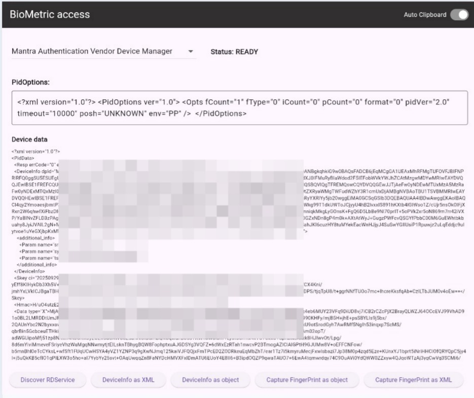
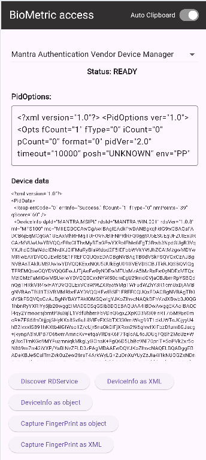

# Biometric Access

The Biometric Access plugin allows for seamless integration of various biometric devices, including fingerprint and IRIS scanners, all within a single plugin. It provides developers with an easy-to-use API to implement secure and efficient biometric-based authentication across multiple supported devices
## Screenshots
<div > 


<div/>

## Supported Platforms
- Android (Under development)
- Web

## Biometric Devices
Planned support for multiple biometric devices
  - **Mantra** (Tested on: MSF100)
  - **Mantra IRIS** (Tested on: MIS100V2)
  - **Morpho** (Partially Tested on: MSO 1300)
  - Secugen (only web)
  - Evolute (only web)
  - Startek (only web)

## Installation

Add `biometric_access` to your `pubspec.yaml`:

```yaml
dependencies:
  biometric_access: ^0.0.1
```

Run `flutter pub get` to install the package.


## Drivers
#### Android
* Download [Mantra Management Client](https://play.google.com/store/apps/details?id=com.mantra.clientmanagement&hl=en_IN) from playstore.
* Download [Mantra RD Service App](https://play.google.com/store/apps/details?id=com.mantra.rdservice&hl=en_IN) from playstore.
* Download [Mantra L1 MSF110 RDservice app](https://play.google.com/store/apps/details?id=com.mantra.mfs110.rdservice&hl=en_IN&hl=en_IN) from playstore.
* Download [Mantra IRIS MIS100V2 RDservice app](https://play.google.com/store/apps/details?id=com.mantra.mis100v2.rdservice&hl=en_IN) from playstore.
* Download [Morpho SCL RDService app](https://play.google.com/store/apps/details/Morpho_SCL_RDService?id=com.scl.rdservice&hl=en_IE) from playstore.

#### Web 

* Download latest Driver and RDService from offical Site
* [Download RD service](https://download.mantratecapp.com/StaticDownload/MantraRDService_1.0.8.exe)
* [Download Windows Driver](https://download.mantratecapp.com/StaticDownload/MFS100Driver_9.2.0.0.exe)

## Instructions for Web
* Plug in your biometric device and make sure drive & RDService are installed correctly
* On the initial setup, you will see a prompt in the bottom-right corner instructing you to unplug and replug the device for proper initialization.
* After reconnecting the device, you should see another prompt confirming the connection of the biometric device.
* Once the device is successfully connected to the server, a `Framework ready` to use message will appear

## Usage/Examples

### Import the Package

```dart
import 'package:biometric_access/biometric_access.dart';
```


### Discover RDServices (Only for Web Platform)

```dart
try {
  List<RdServiceModel> result = await BiometricAccess().discoverRDServices();
  if (result.isNotEmpty) {
    result.forEach((e)=> print(e.rdInfo));
  _biometricAccessPlugin.setRDService=result[0]; //Update Current RDService
  } else {
    print('No RDService found, please restart services on Windows'); 
  }
 } on RDClientNotFound catch (err)  {
    print(err.toJson());
 } catch (e) => customToast(e.toString());
```


### Device Info as XML 

```dart
try {
  String result = await BiometricAccess().getDeviceInfoAsXML();
  print(result); //Returns Raw deviceInfo XML with out Validation
 } catch (e) => print(e.toString());
```


### Device Info as (String, DeviceInfoModel) 

```dart
try {
  (String, DeviceInfoModel) result = await BiometricAccess().getDeviceInfoAsObject();
  print(result); //Returns DeviceInfo as ([String],[DeviceInfoModel])
 } catch (e) => print(e.toString());
```


### Capture Finger print as XML 
```dart
try {
  String result = await BiometricAccess().captureFingerPrintAsXml();
  print(result); // Returns Raw capture XML with out Validation
 } catch (e) => print(e.toString());
```


### Capture Finger print as (String, PidDataModel)

```dart
try {
  (String, PidDataModel) result = await BiometricAccess().captureFingerPrintAsObject();
  print(result); //Returns capture Response as ([String],[PidDataModel])
 } catch (e) => print(e.toString());
```


## Contributing
We welcome contributions! Please feel free to submit pull requests, issues, or feature requests.


## License
[MIT License](LICENSE)


## Authors

- [@SureshKumar311](https://www.github.com/SureshKumar311)

- [](https://linkedin.com/in/sureshkumar311)
